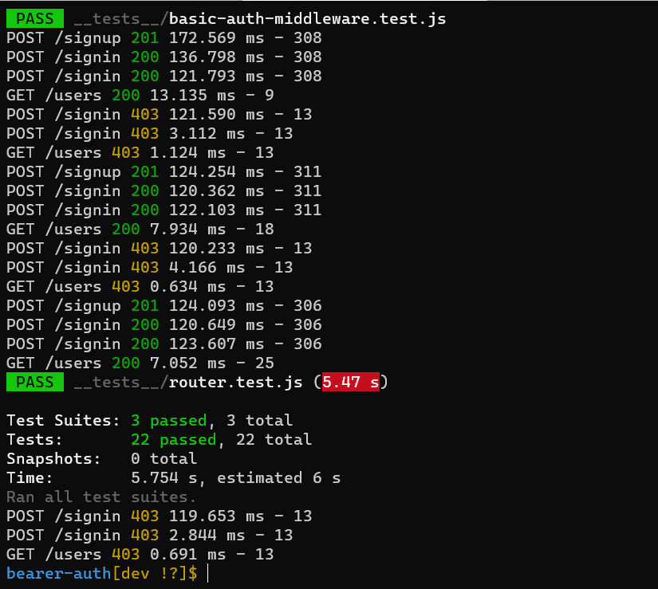
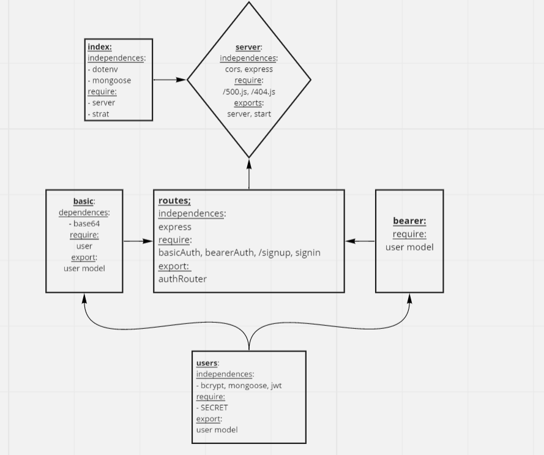

## bearer-auth

# LAB: 07: Bearer Authorization

## Description

Authentication Server Phase 2: Token (Bearer) Authentication

At this point, our auth-server is able to allow a user to create an account as well as to handle Basic Authentication (user provides a username + password). When a “good” login happens, the user is considered to be “authenticated” and our auth-server generates a JWT signed “Token” which is returned to the application

We will be using that Token to re-authenticate users to shield access to any route that requires a valid login to access.

#### Phase 2 Requirements
- Obtain a token after user signin, so that user can re-authenticate
- user use his token to access routes that require a valid user
- provied safe logging in to the user 

#### Secure the JWT Tokens:

- Add support for the creation and usage of time sensitive (valid for 15 minutes) JWTs

#### Dependencies

Express, Dotenv, Jest, Morgan, Bcrypt, Mongoose, Cors, @code-fellows/supergoose, jsonwebtoken

#### TESTS:

## URL:

Heroku app link:

GitHub actions link:

Pull Rrequest link:

## UML

